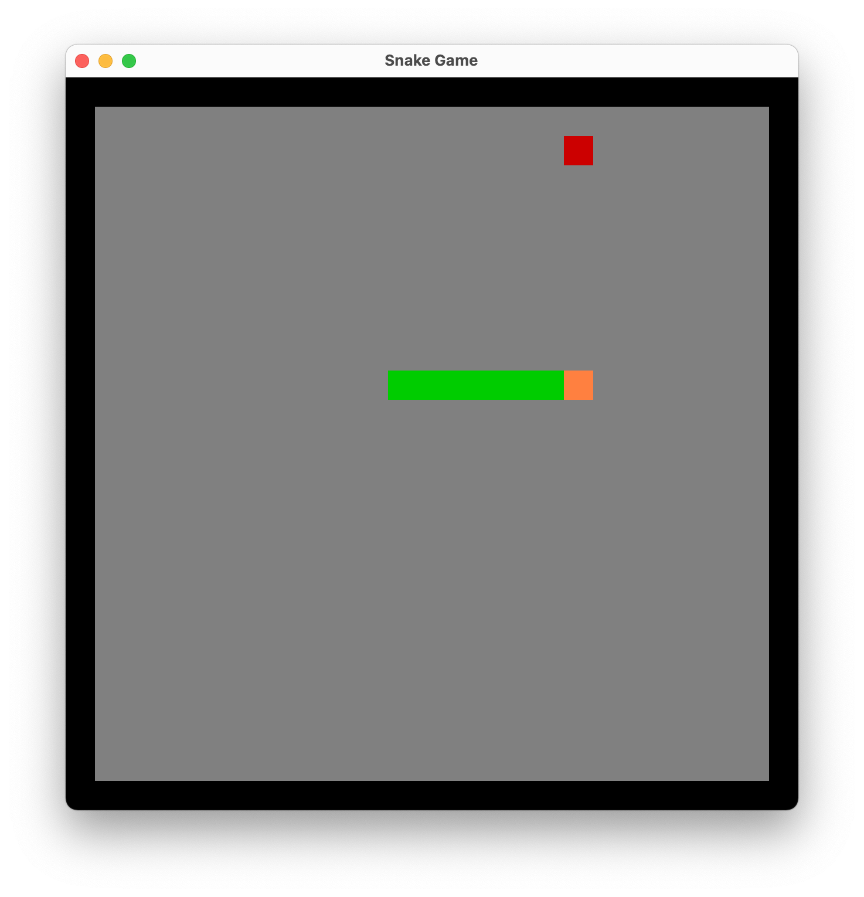
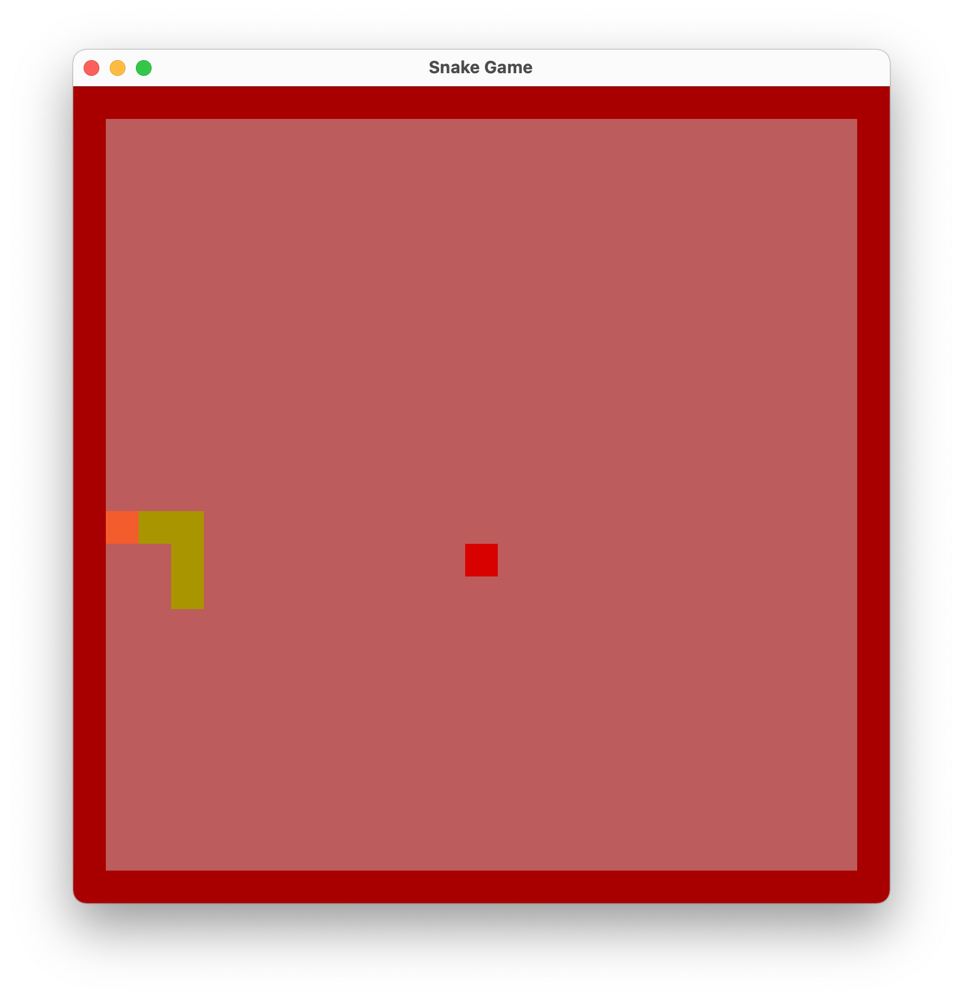

# Full featured Snake game

Project was created according the video blog from the Youtube channel **"Tensor Programming"** - [Rustlang Project: Snake Game](https://www.youtube.com/watch?v=DnT_7M7L7vo&list=PLJbE2Yu2zumDF6BX6_RdPisRVHgzV02NW&index=8).
You will find there a quiet more project author's architecture explanations.

* check the project with:
```
cargo check
```  
* run the game with:
```
cargo run
```

* screenshots:



